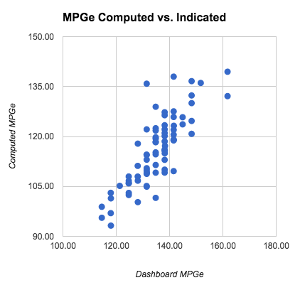

As I complete my first year with the 500e I wanted to share some of the data I have been collecting in case others might find it interesting.

Summary of what I learned looking at the data

The %charge indicator is very accurate. 
On average the MPGe indicated on the dash is 17% too high.
On 1 hour of charging you can drive:
3.8 miles if charging at 120V
12.5 miles if charging from a 240V TurboCord
20 miles if charging from a Level 2 Charger
 

Details

Each time I charged the car I collected the percentage of charge remaining, the miles driven and the MPGe estimate. When I charged at public stations that provide statistics on the number of kWh charged I tracked that also.

In trying to look at the accuracy of the charge indicator I needed a known reference to measure against. The only way I found was to use the measurements of ChargePoint charging stations. Whenever I charge the car at a ChargePoint station it will give me an exact reading of the kWh used.  I then compare that to the change in the battery charge indicator.  The computed kWh is found by:

    (ending percentage - starting percentage) * 24 kWh (the battery capacity)

Using this I plot the computed kWh against the measured kWh.  Doing this produces:

As you can see the values match very well.

Once I established the accuracy of computing the kWh consumption based on the change in the percentage of the battery charge indicator I could use this to understand the accuracy of the other dash readouts.

Comparing the MPGe (or miles/kWh) estimated on the dash to the values computed I found that it was the results varies quite a bit. As we can see here the computed MPGe for a given dashboard MPGe can vary quite a bit.

 

If we look at the error in each data point and plot that on a histogram we get:

From which I computed the average overestimation of 17%. Even though the dashboard indicator over-estimates the MPGe my actual MPGe after a year of driving was 115 which is higher than the value quoted by Fiat.

 When looking at EVSE's (chargers) they quote the amount of time it takes to fully charge a car.  I don't find this that useful. I often worry that my current charge is not adequate for where I'm trying to go and I want to know how how long it will take to charge to get X extra miles. I found that expressing charge rates in miles of driving per hour of charging to be useful for this. The results above are averages based on 66 individual partial charges. I did tend to notice that the car will charge slower as it approaches 100% so you can actually get above these rates if you are only partially charging the car.

 

 