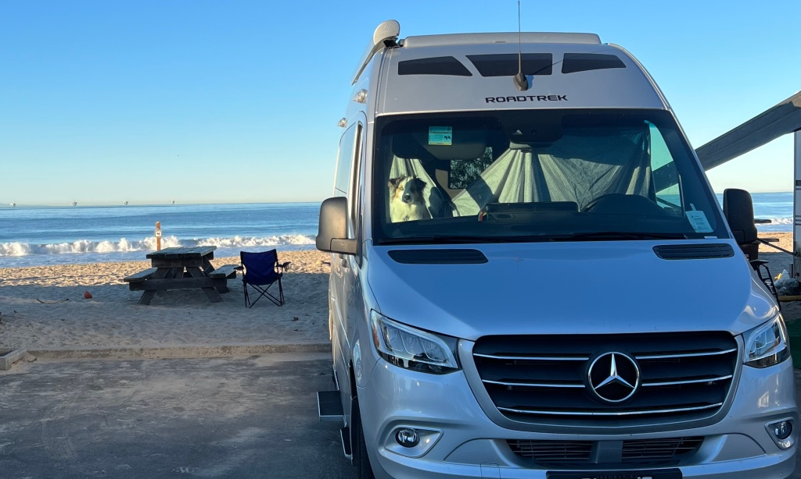

Located just south of Santa Barbara, Carpinteria State Park Campground is a perfect destination for anyone looking for a beachside retreat that also offers access to nearby amenities. With campsites situated right on the beach, some with hookups, visitors can enjoy stunning views of the Pacific Ocean and a range of outdoor activities.

One of the standout features of this campground is its proximity to Carpinteria’s charming downtown area, where visitors can find a variety of restaurants and shops within easy walking distance. Whether you’re in the mood for seafood, Mexican cuisine, or a classic burger and fries, you’ll find plenty of options to suit your tastes.

For those interested in exploring the area’s natural wonders, Carpinteria State Park is also within walking distance of the Tar Pits Park, where visitors can learn about the area’s prehistoric past and view fossils and other artifacts. And if you’re looking for even more outdoor adventure, you can hop on the Ventura bike trail, which runs all the way to Ventura and offers stunning views of the coastline.

But perhaps one of the best things about Carpinteria State Park Campground is that it’s one of the closest campgrounds to downtown Santa Barbara. This means that visitors can easily explore the city’s many attractions, including museums, art galleries, and historic landmarks, before returning to their peaceful beachside oasis.

Overall, Carpinteria State Park Campground offers a unique combination of natural beauty, convenience, and accessibility that’s hard to beat. Whether you’re looking for a weekend getaway or a longer stay, this campground is sure to exceed your expectations.