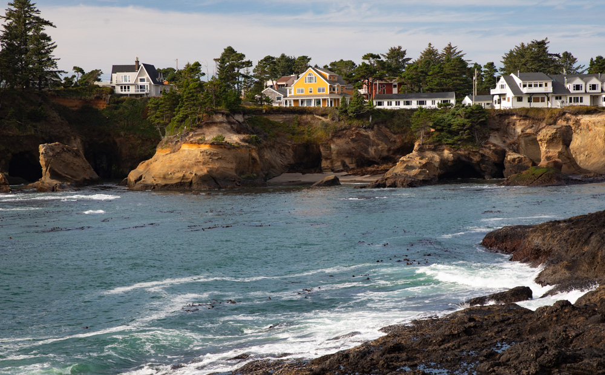
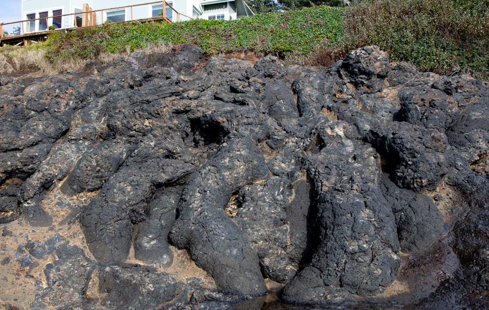

The drive down 101 in Oregon is always beautiful and there are so many places to stop that it is easy to miss one. We had not stopped in Depoe Bay which is surprising since there is a parking lot that overlooks the ocean and the view is beautiful. The cove there has bends around and there are houses right on the bluff that were interesting to see.

Right below the parking lot are cool basalt fingers. So often when I see basalt it is broken up but here you can see the original structure of the flow as the lava ran into the ocean.

I also found it interesting that while all the rock below the parking lot is basalt, the rock below the homes were sandstone, and that sandstone is eroded into small caverns.