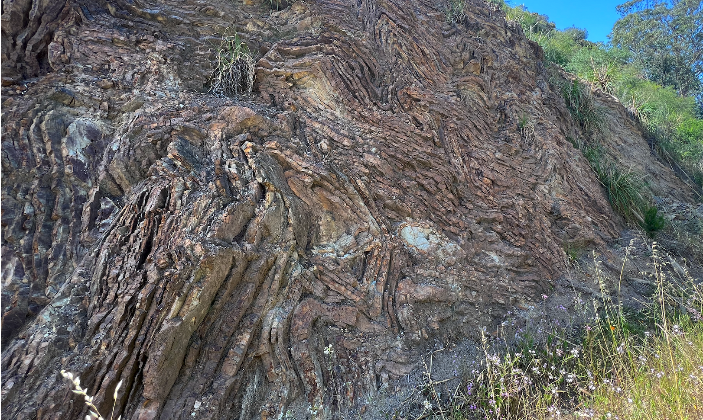
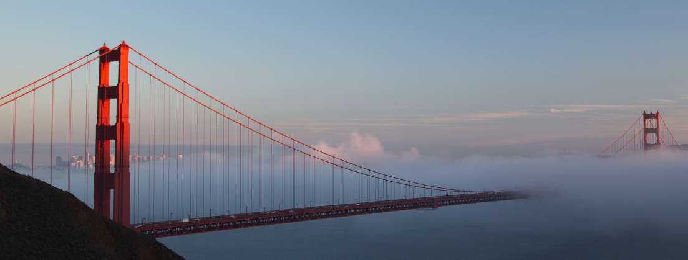

I'd read about folded radiolarian chert getting pushed up onto land and I've seen pictures but I have to say the pictures do not do it justice. Driving down Conzelman Road in Sausalito you can get up close and it is quite a sight.

While you're in the area, it is worth going to Black Sands Beach to see the black sand, it is quite striking, and the pillow basalt.

And, while not rock related you have to stop at the Golden Gate View Point as it gives you a spectacular view of the bridge with the city of SF in the background. If you're lucky you'll catch it at sunset with the fog rolling in.

