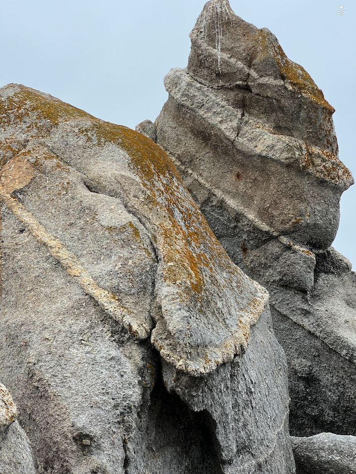
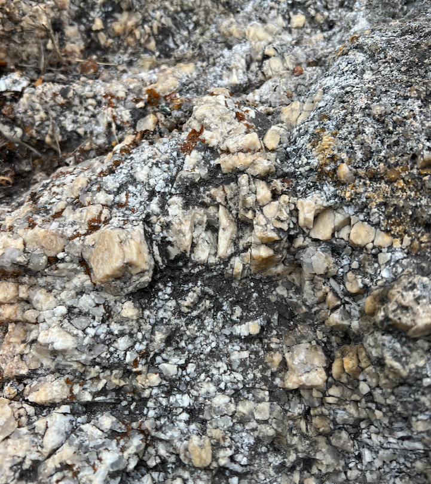

 

Cora and I love climbing around the rocks at Monastery Beach in Carmel. We get to see granite in a lot of places in California but it is rare than you can see it layered like this, especially in such as accessible place. If you're ever heading to Big Sur it is worth stopping here to walk around.