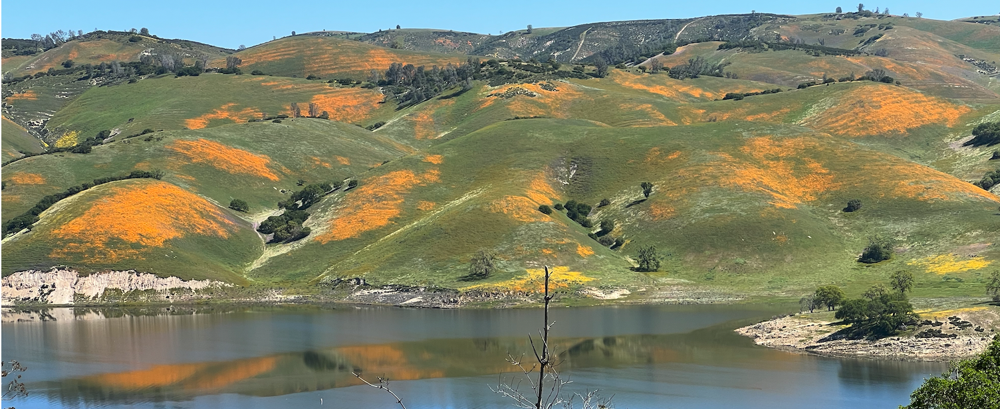
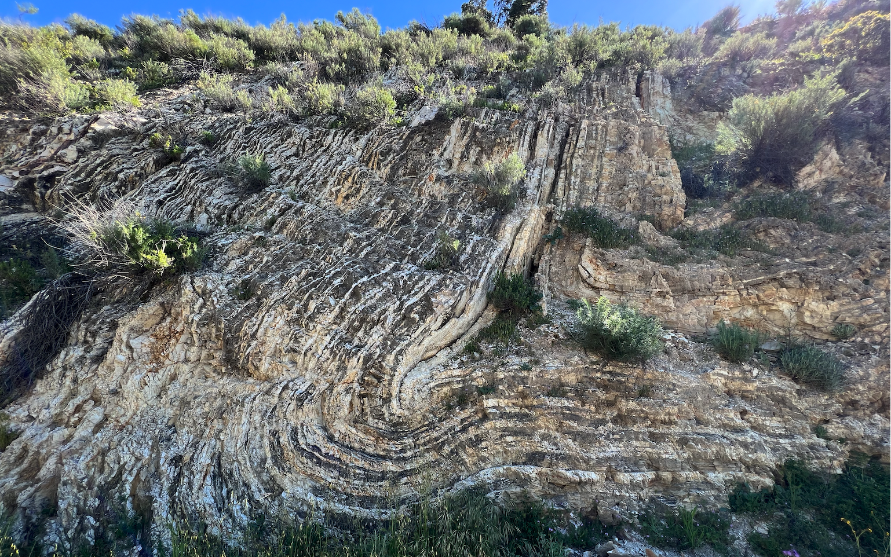

With the big rainfalls we have had this year we knew that there would be wildflowers.  While spending a few days in Paso Robles we thought we would explore a little and ended up heading over to Lake Nacimiento.  It was definitely worth the trip as the wild flowers were out in force.

While the wild flowers were the highlight of the trip on our way back to the freeway I spotted this great folded sandstone which was completely unexpected. I should have added something into the picture to give it scale.  The picture here is about 20' tall.

