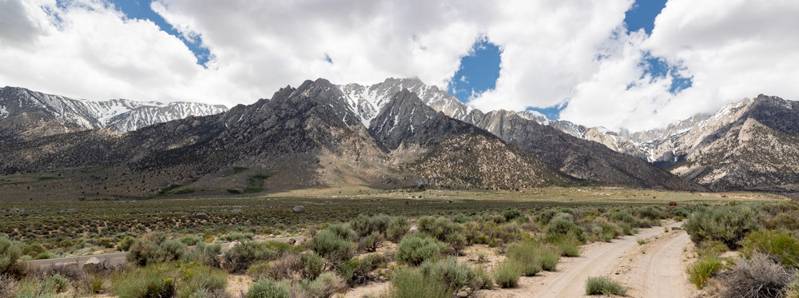
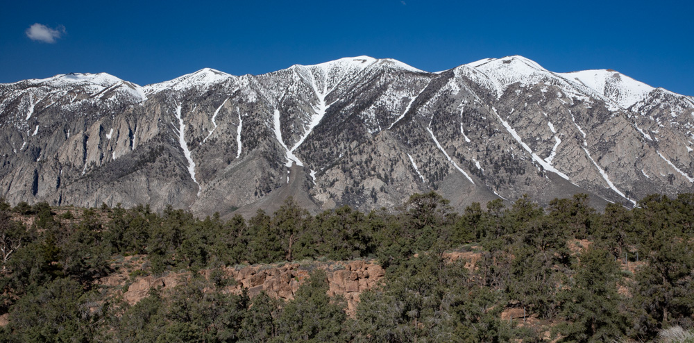
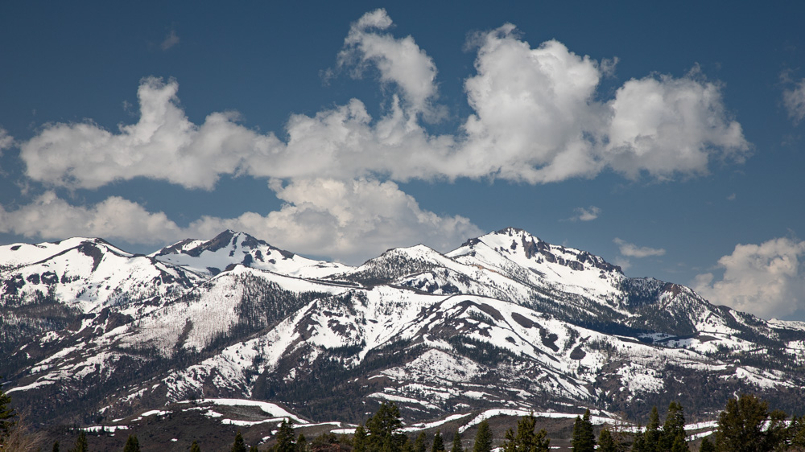

After a year with a lot of snow in the Sierra's it was hard to know the right time to go on this trip.  We wanted to be able to camp without being impeded by snow but we also wanted to go before school ended and the crowds showed up. It turned out to be a great time to go as there was still snow in the mountains but we had great weather for most of the trip. The mountain range is spectacular.

One of the things I wanted to see was the Bishop Tuff which was a huge tuff flow from the Mammoth caldera.  Above you can see the pinkish layer of tuff, which is over 1,000 feet tall, below the granite of the Sierra Nevada's.

Looking at these mountains it is easy to see why skiers are drawn to the Sierras.