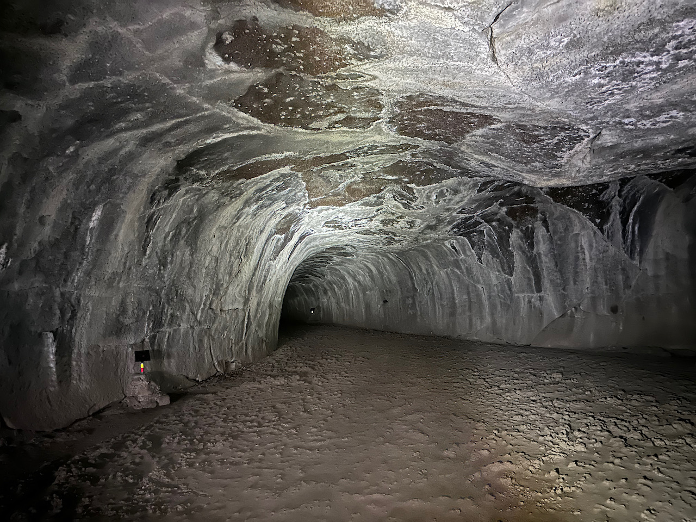

On this trip we learned a lot about lava tubes.  There are huge ones like the Lava River Cave in the Newberry Volcanics to smaller ones like the Subway Cave near Burney Falls. For us, the Subway Cave was way more fun.  It is such a great example of a lava tube and you can just drive up and walk through it. We went through early in the morning and were the only people in the tube. This tube is very easy to walk through.

Walking  above the tube it was interesting to see how much vegetation is growing right above all the basalt with so little soil.