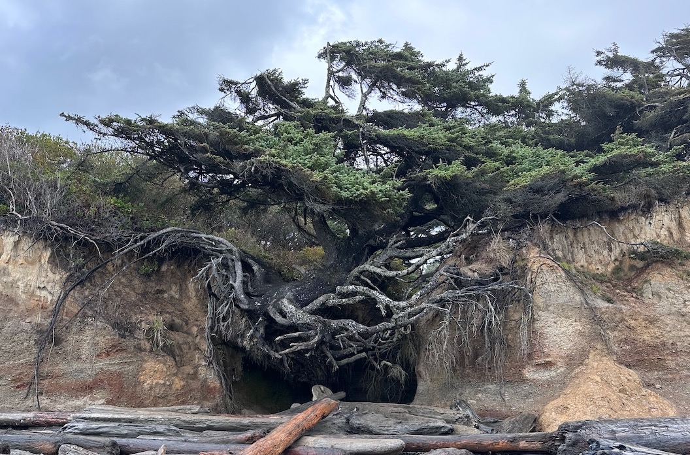

During our camping trip in Washington, we had the opportunity to explore Olympic National Park. Unfamiliar with the area, I turned to Google Maps in search of noteworthy attractions and stumbled upon the "Tree of Life." Its proximity to our route piqued my curiosity, compelling us to make a detour. The sight was fascinating: a tree remarkably thriving despite the ground beneath it having eroded away, leaving its roots entirely exposed. Witnessing this natural marvel was unexpected and well worth the stop.